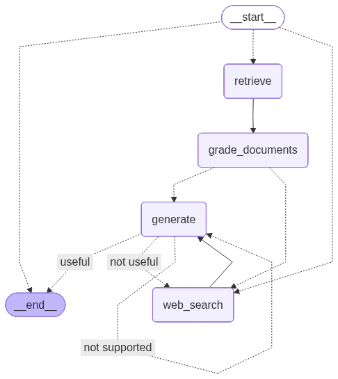

# Agentic RAG with LangGraph

This project implements an **Agentic RAG** workflow using **LangGraph**, combining **Adaptive RAG**, **Corrective RAG (CRAG)**, and **Self-RAG** techniques. It moves beyond simple retrieve-and-generate pipelines by incorporating dynamic routing, document grading, and self-reflection steps to ensure accuracy and reliability.

## 🌟 Inspiration
This project is inspired by and based on the following resources:
- [LangGraph Course - Agentic RAG](https://github.com/emarco177/langgraph-course/tree/project/agentic-rag) by Eden Marco.
- [Mistral AI Cookbook - LangGraph CRAG](https://github.com/mistralai/cookbook/tree/main/third_party/langchain) by Mistral AI and LangChain.

## 📚 Foundational Research
The architecture of this project is based on the following key research papers:
- **Corrective RAG (CRAG):** [Corrective Retrieval Augmented Generation](https://arxiv.org/abs/2401.15884) - Introduces the concept of using a retrieval evaluator to trigger web searches for missing or irrelevant knowledge. (See `docs/Corrective-RAG_CRAG.pdf`)
- **Self-RAG:** [Self-RAG: Learning to Retrieve, Generate, and Critique through Self-Reflection](https://arxiv.org/abs/2310.11511) - Focuses on LLMs critiquing their own retrieved documents and generations for factuality. (See `docs/Self-RAG_Self-Reflection.pdf`)
- **Adaptive RAG:** [Adaptive-RAG: Learning to Adapt Retrieval-Augmented LLMs through Question Complexity](https://arxiv.org/abs/2403.14403) - Explains how to route queries based on their complexity to different RAG strategies. (See `docs/Adaptive-RAG_Routing.pdf`)

## 🏗️ Architecture
The system is built as a stateful graph using LangGraph. It employs a sophisticated multi-stage process to handle queries effectively.



### Core Nodes & Chains:
1.  **Router:** An initial decision point that routes the question to either the local **Vector Store** or a **Web Search** based on the topic.
2.  **Retrieve:** Fetches documents from a local **ChromaDB** vector store (containing knowledge from Lilian Weng's blog posts).
3.  **Grade Documents:** Assesses the relevance of retrieved documents. If relevance is low, it triggers a supplemental web search.
4.  **Web Search:** Uses **Tavily Web Search** to find up-to-date or missing information.
5.  **Generate:** Synthesizes the final answer using the filtered context.
6.  **Self-Reflection (Graders):**
    *   **Hallucination Grader:** Checks if the generation is grounded in the provided documents.
    *   **Answer Grader:** Checks if the generation actually addresses the user's question.

### Control Flow:
- **Routing:** The graph starts with a conditional entry point that determines whether to retrieve from local docs or search the web immediately.
- **Correction:** After retrieval, documents are graded. If any are deemed irrelevant, the system transitions to a web search.
- **Reflection:** Once an answer is generated, it is validated. If it's not supported by the context or doesn't answer the question, the system may re-generate or perform a broader search.

## 🚀 Key Features
- **Adaptive Routing:** Intelligently chooses the best data source for the query.
- **Corrective RAG (CRAG):** Dynamically corrects the retrieval process based on document quality.
- **Self-Reflection (Self-RAG):** Uses feedback loops to minimize hallucinations and ensure answer utility.
- **Structured Grading:** Uses OpenAI's Structured Outputs for reliable decision-making.
- **Stateful Orchestration:** Leverages LangGraph to manage the complex loop-based workflow.

## 🛠️ Setup & Installation

### Prerequisites
- Python 3.13+
- [Tavily API Key](https://tavily.com/)
- [OpenAI API Key](https://platform.openai.com/)

### Environment Variables
Create a `.env` file in the root directory:
```env
OPENAI_API_KEY=your_openai_api_key
TAVILY_API_KEY=your_tavily_api_key
USER_AGENT=AgenticRAG/1.0
```

### Installation
Using `uv` (recommended):
```bash
uv sync
```

### Data Ingestion
The project includes an `ingestion.py` script that loads content from Lilian Weng's blog posts into a local ChromaDB collection.
```bash
python ingestion.py
```

## 📖 Usage
Run the main application to query the agent:
```bash
python main.py
```

By default, it asks: *"What is Claude Code"* and follows the agentic workflow to provide a response.

## 📂 Project Structure
```text
├── docs/            # Foundational research papers (CRAG, Self-RAG, Adaptive RAG)
├── graph/
│   ├── chains/      # LLM chains for routing, grading, and generation
│   ├── nodes/       # Graph node implementations (retrieve, grade, search, generate)
│   ├── graph.py     # Graph definition and orchestration
│   ├── state.py     # TypedDict for graph state
│   └── consts.py    # Shared constants
├── ingestion.py     # Document loading and vector store setup
└── main.py          # Entry point
```
